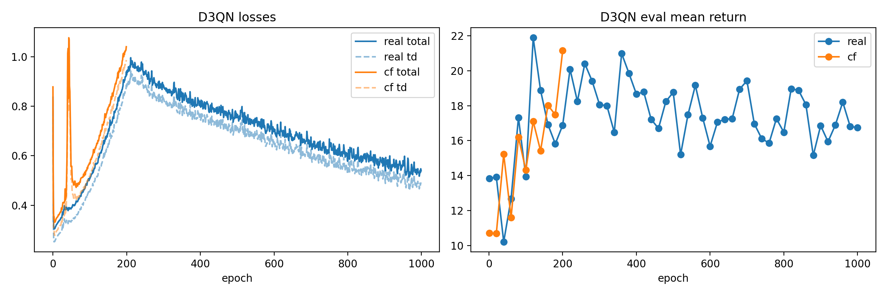

# ECE595 Causal RL Deep Dive
Compact codebase for our CTRL (counterfactual RL) CartPole study with CF-augmented D3QN, SAC, Rainbow baselines, and recorded demos.

## Quickstart
1) Install deps in a venv (Python 3.10+):
```bash
pip install torch gymnasium numpy matplotlib seaborn tqdm scikit-learn pandas
```
2) Build the SD dataset:
```bash
python scripts/train.py dataset --episodes 250 --horizon 200 --output data/SD_dataset_clean.pt
```
3) Train:
- BiCoGAN (CF generator):  
  `python scripts/train.py bicogan --dataset-path data/SD_dataset_clean.pt`
- D3QN real-only:  
  `python scripts/train.py d3qn --dataset-path data/SD_dataset_clean.pt`
- D3QN + CF (example cf_frac=0.10):  
  `python scripts/train.py d3qn --dataset-path data/SD_dataset_clean.pt --use-cf --cf-k 1 --cf-sample-frac 0.10 --cf-action-noise-std 0.05 --cf-use-env-step --bicogan-dir results/cartpole/bicogan/<ts>`
- SAC baseline:  
  `python scripts/train.py sac --dataset-path data/SD_dataset_clean.pt`

4) Evaluate (clean vs CTRL noisy env):
```bash
python scripts/eval.py --algo d3qn --run-dir results/cartpole/d3qn_cf/<run> --episodes 50
python scripts/eval.py --algo d3qn --run-dir results/cartpole/d3qn_cf/<run> --episodes 50 --use-ctrl-env
```

5) Plots (override evals if needed):
```bash
python scripts/plot_results.py --d3qn-real results/cartpole/d3qn_real/<run>/metrics.json \
  --d3qn-cf results/cartpole/d3qn_cf/<run>/metrics.json \
  --output-dir results/plots_cf_final \
  --eval-override 'D3QN real=results/eval/d3qn/<clean_eval>.json' \
  --eval-override 'D3QN CF=results/eval/d3qn/<ctrl_eval>.json'
```

6) Record a demo video:
```bash
python scripts/infer.py --algo d3qn --model-path results/cartpole/d3qn_cf/20251208-031646/q_net.pt \
  --dataset-path data/SD_dataset_clean.pt --episodes 2 --record
```

## Key Results (50-episode evals)
| Model | Clean mean ± std | CTRL noisy mean ± std | References |
|---|---|---|---|
| D3QN real-only | 34.4 ± 22.3 | 16.7 ± 9.2 | `results/eval/d3qn/20251208-011544/d3qn.json`, `results/eval/d3qn/20251208-011553/d3qn.json` |
| Rainbow (offline) | 10.9 ± 1.7 | n/a | `results/eval/rainbow/20251208-003300/rainbow.json` |
| D3QN CF (0.25) | 52.4 ± 25.6 | 18.6 ± 10.7 | `results/eval/d3qn/20251208-030337/d3qn.json`, `results/eval/d3qn/20251208-030347/d3qn.json` |
| D3QN CF (0.10) | 51.3 ± 26.6 | 19.1 ± 12.6 | `results/eval/d3qn/20251208-030839/d3qn.json`, `results/eval/d3qn/20251208-030846/d3qn.json` |
| D3QN CF (0.05) | 127.9 ± 66.1 | 21.1 ± 12.9 | `results/eval/d3qn/20251208-031715/d3qn.json`, `results/eval/d3qn/20251208-031725/d3qn.json` |

## Plots



## Demos (videos)
- CartPole CF (0.05) recorded: `results/infer/d3qn/20251208-180811/demo-episode-0.mp4` (returns 94, 135).
- Earlier CartPole demos: `results/infer/d3qn/20251207-223936/demo-episode-0.mp4`, `results/infer/d3qn/20251207-223945/demo-episode-0.mp4`.
- SAC demo: `results/infer/sac/20251207-223952/demo-episode-0.mp4`.
- Rainbow demo: `results/infer/rainbow/20251207-224001/demo-episode-0.mp4`.
- Lunar Lander random policy: `results/infer/lunar/20251208-182039/demo-episode-0.mp4`, `demo-episode-1.mp4` (Box2D runtime verified).

## Repo Map
- `scripts/`: dataset, train, eval, infer, plotting.
- `CTRL/`, `ctrl_algorithms/`: env/dynamics, BiCoGAN, D3QN/SAC/Rainbow models and utilities.
- `data/`: SD dataset.
- `results/`: training artifacts, eval JSONs, plots, demos.
- `RUN_SUMMARY.md`, `ANALYSIS_NOTES.md`: experiment log + details for the report.
